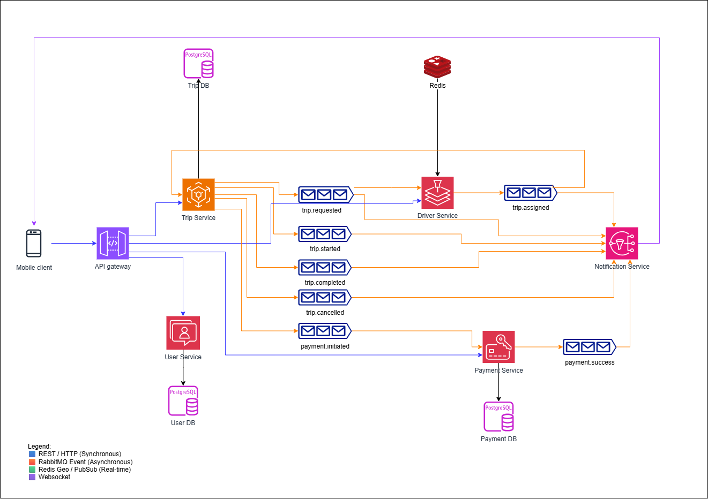

# UIT-Go Cloud-Native Architecture  
### Module A — Scalability & Performance  

---

## I. System Context  

UIT-Go is a **distributed backend system** developed for a ride-hailing platform.  
The project aims to simulate a production-grade backend capable of handling high concurrency (thousands of trip requests and driver updates per second).  

Module A focuses on **architectural scalability and performance optimization** — scaling by design rather than hardware.  
We focus on eliminating bottlenecks in three main flows:
- Trip creation and assignment  
- Real-time driver location updates  
- Notification fan-out at scale  

Key architectural objectives:  
- **Horizontal scalability** through stateless microservices and container orchestration (Docker + ECS).  
- **Asynchronous event-driven communication** to absorb load spikes.  
- **Low latency** via caching and in-memory geospatial indexing.  
- **Balanced trade-offs** between performance, cost, and complexity.  

---

## II. Core Architecture  

UIT-Go adopts a **domain-driven microservices model** — each service owns its logic, data, and scaling policy.  

| Service | Responsibility | Data Layer | Communication |
|----------|----------------|-------------|----------------|
| **API Gateway** | Central entry, routing, JWT validation | — | REST |
| **User Service** | Manage passengers & drivers | PostgreSQL | REST |
| **Driver Service** | Real-time location updates & availability | Redis Geo | REST + RabbitMQ |
| **Trip Service** | Trip creation, driver matching, lifecycle management | PostgreSQL | REST + RabbitMQ |
| **Payment Service** | Fare computation & transactions | PostgreSQL | REST + RabbitMQ |
| **Notification Service** | Push events to users in real time | — | RabbitMQ + WebSocket |

### Communication Patterns  
- **REST (Sync):** For predictable, short-lived operations.  
- **RabbitMQ (Async):** To decouple heavy load between Trip–Driver–Notification.  
- **Redis Geo:** For geospatial lookups and caching (sub-10 ms).  
- **WebSocket:** For realtime user notifications.  

---

## III. System Flow Overview  
The following diagram shows the Event-Driven Architecture implemented in UIT-Go. 



---

## IV. Detailed Architecture for Module A — Scalability & Performance  
### 4.2. Scalable Architecture Stack for Module A  

```text
┌────────────────────────────────────────────────────────────────────────────┐
│                         CLIENT & ACCESS LAYER                             │
├────────────────────────────────────────────────────────────────────────────┤
│ - API Gateway handles JWT validation, rate-limiting, and routing.          │
│ - Load balancing across multiple stateless service instances.              │
│ - Enables horizontal scaling and uniform entry point for all traffic.      │
└────────────────────────────────────────────────────────────────────────────┘

┌────────────────────────────────────────────────────────────────────────────┐
│                         APPLICATION SERVICE LAYER                          │
├────────────────────────────────────────────────────────────────────────────┤
│ - Each microservice (Trip, Driver, Payment, User, Notif) runs independently│
│   in containerized tasks on ECS/EKS.                                       │
│ - Stateless design → easy horizontal scaling.                              │
│ - Service-specific scaling policies: TripSvc by queue depth, DriverSvc by  │
│   Redis ops/sec, NotifSvc by active WebSocket connections.                 │
│ - Idempotent consumers ensure exactly-once message processing.             │
└────────────────────────────────────────────────────────────────────────────┘

┌────────────────────────────────────────────────────────────────────────────┐
│                           MESSAGING & ASYNC LAYER                          │
├────────────────────────────────────────────────────────────────────────────┤
│ - RabbitMQ decouples Trip and Driver Services via event queues.            │
│ - Asynchronous processing absorbs burst traffic and avoids service blocking│
│ - Dead-Letter Queue (DLQ) + retry mechanism enhance reliability.           │
│ - Prefetch tuning (50–200) maintains optimal throughput.                   │
└────────────────────────────────────────────────────────────────────────────┘

┌────────────────────────────────────────────────────────────────────────────┐
│                             CACHING & GEO LAYER                            │
├────────────────────────────────────────────────────────────────────────────┤
│ - Redis GEO stores driver coordinates in memory for <10ms lookups.         │
│ - TTL-based expiration (30–60s) keeps data fresh and lightweight.          │
│ - allkeys-lru eviction prevents memory overflow under high concurrency.    │
│ - Write coalescing/debounce reduces network chatter and improves hit rate. │
└────────────────────────────────────────────────────────────────────────────┘

┌────────────────────────────────────────────────────────────────────────────┐
│                              DATA STORAGE LAYER                            │
├────────────────────────────────────────────────────────────────────────────┤
│ - PostgreSQL primary handles writes; read replicas handle analytics reads. │
│ - Connection pool tuning (HikariCP) ensures consistent latency under load. │
│ - Indexes on hot columns (status, created_at, driver_id) improve queries.  │
│ - Read replicas improve query throughput by ~1.5× during spikes.           │
└────────────────────────────────────────────────────────────────────────────┘

┌────────────────────────────────────────────────────────────────────────────┐
│                           INFRASTRUCTURE & SCALING LAYER                   │
├────────────────────────────────────────────────────────────────────────────┤
│ - ECS Auto Scaling: dynamic scaling by CPU, queue depth, and latency.      │
│ - Cooldown periods prevent oscillation (flapping).                         │
│ - Service mesh or discovery (optional) ensures fault-tolerant routing.     │
└────────────────────────────────────────────────────────────────────────────┘

┌────────────────────────────────────────────────────────────────────────────┐
│                           OBSERVABILITY & CONTROL LAYER                    │
├────────────────────────────────────────────────────────────────────────────┤
│ - Grafana + CloudWatch visualize latency, queue depth, DB usage.           │
│ - OpenTelemetry / AWS X-Ray provide distributed tracing.                   │
│ - Continuous monitoring supports SLO validation and regression detection.  │
└────────────────────────────────────────────────────────────────────────────┘
```text

> This figure illustrates how each technical layer in UIT-Go’s backend contributes to achieving **scalability**, **low latency**, and **resilience** under high load.  
>  
> - **Client & Access Layer:** Centralized entry point through API Gateway ensures secure, rate-limited, and horizontally scalable access for all clients.  
> - **Application Service Layer:** Stateless containerized microservices (Trip, Driver, Payment, User, Notification) allow independent scaling and isolation of workloads.  
> - **Messaging & Async Layer:** RabbitMQ acts as a buffer, decoupling services and absorbing burst traffic for high availability and elasticity.  
> - **Caching & Geo Layer:** Redis GEO provides sub-10 ms lookups for driver locations and reduces database load through TTL-based caching.  
> - **Data Storage Layer:** PostgreSQL with read replicas ensures fast query responses and high throughput during peak usage.  
> - **Infrastructure & Scaling Layer:** ECS/EKS auto-scaling policies dynamically adjust service capacity based on real-time performance metrics.  
> - **Observability & Control Layer:** Grafana, CloudWatch, and X-Ray provide deep visibility into latency, queue depth, and system health—enabling data-driven optimization.  
>  
> Collectively, these layers demonstrate how Module A transforms UIT-Go into a **hyper-scalable, event-driven architecture** capable of sustaining 20 k+ RPS with predictable performance and fault tolerance.


### 4.2. Implementation Plan for Module A

#### 🎯 Objective  
To **design, validate, and optimize** UIT-Go’s architecture for extreme scalability and low latency under high load.  
This phase aims to **prove** architectural soundness using measurable data and to **defend key trade-offs** (e.g., consistency vs latency, cost vs performance).

#### 1️⃣ Analyze & Justify Architectural Decisions  

**Goal:**  
Identify and analyze the most critical business flows — *Trip Assignment* and *Driver Location Update* — to select and justify architectural design decisions that ensure system scalability and resilience under high load.  

---

**Architectural Focus Areas**

| Decision | Implementation Direction | Expected Advantage | Potential Trade-off |
|-----------|--------------------------|--------------------|----------------------|
| **Asynchronous Messaging (RabbitMQ or SQS)** | Decouple TripService and DriverService using message queues | Absorbs burst load, prevents service blocking | Slightly higher response latency (~200 ms) |
| **Redis Geo for Real-Time Driver Lookup** | Store and query driver coordinates in-memory using Redis GEO | <10 ms geospatial lookup, reduced DB queries | Higher RAM usage, requires TTL and cleanup strategy |
| **PostgreSQL Read Replicas** | Separate read operations from the primary database | Improves throughput under heavy query load | Eventual replication lag (~100–200 ms) |
| **ECS Auto Scaling** | Dynamically scale services based on CPU, queue depth, or latency metrics | Ensures elasticity during traffic spikes | Variable cost depending on load |
| **Idempotent Message Consumers** | Guarantee that messages are processed exactly once when retries occur | Improves fault tolerance, prevents duplicate trip assignment | Requires more complex business logic |

---

**Action Steps**

1. **Analyze the two main business flows**  
   - Map each interaction within *Trip Creation & Assignment* and *Driver Location Update*.  
   - Identify critical bottlenecks and high-load risks.  

2. **Experiment with communication models**  
   - Configure and compare two environments: **REST-only** vs **REST + MQ**.  
   - Run the same workload to compare throughput, latency, and resource usage (CPU, queue depth).  

3. **Measure and collect performance data**  
   - Record key metrics such as p95 latency, queue depth, CPU usage, DB query time, and Redis ops/sec.  
   - Analyze data to determine the most efficient communication and caching strategies.  

4. **Evaluate and document architecture decisions**  
   - Record context, explored alternatives, and justification for each decision.  
   - Highlight the trade-offs between performance, cost, and complexity.  
   - Prepare structured notes for inclusion in the project’s Architectural Decision Records (ADRs).  

---
  
#### 2️⃣ Validate Architecture via Load Testing  

**Goal:**  
To validate the UIT-Go architecture through **quantitative load and stress testing**, ensuring the system can sustain production-level concurrency, recover from spikes, and maintain service-level objectives (SLOs) under varying load conditions.

**Tools:**  
- **k6 / JMeter / Locust** for traffic generation  
- **Grafana + CloudWatch** for monitoring system health and metrics  
- **AWS X-Ray / OpenTelemetry** for distributed tracing and performance profiling  

**Measurement Approach:**  
Each SLO will be measured under identical request patterns and traffic models to ensure consistency and comparability between test phases.

**Service-Level Objectives (SLOs)**

| Flow | Metric | Target |
|------|---------|---------|
| Trip creation | p95 latency | < 250 ms |
| Trip assignment | Time-to-assign | < 2 s |
| Driver location update | p95 latency | < 100 ms |
| MQ queue depth | Stability under spike | < 5k messages |
| Redis cache | Hit rate | > 85% |
| DB read/write | p95 latency | < 50 / 100 ms |

**Load Test Scenarios**  
1. **Baseline Test:** 5k–10k requests per second (RPS); measure steady-state throughput and latency.  
2. **Stress Test:** Double the baseline load; monitor queue depth, scaling latency, and system stability.  
3. **Soak Test:** Maintain 60–90 minutes of continuous load to detect potential memory leaks and CPU drift.  
4. **Failure Injection:** Simulate database lag, message queue delay, or container restarts to observe recovery behavior and resilience.

---

#### 3️⃣ Apply Optimization & Tuning  

**Goal:** Implement **targeted performance improvements** to eliminate bottlenecks and verify measurable gains.

#### 🔧 Optimization Focus

| Area | Change | Expected Impact |
|-------|---------|----------------|
| **RabbitMQ** | Adjust consumer concurrency, prefetch (50–200), enable DLQ + retry mechanism | Stable queue depth, reduced message lag |
| **Redis** | Set TTL (30–60s), apply `allkeys-lru` eviction, enable write coalescing/debounce | >85% cache hit-rate, reduced DB load |
| **Database (PostgreSQL)** | Add read replicas, tune HikariCP pool size, create indexes on hot columns | 1.5× faster queries under load |
| **Auto Scaling (ECS/EKS)** | Scale TripSvc & DriverSvc dynamically by CPU usage & queue depth | Smooth scaling during traffic bursts |
| **API Gateway** | Configure rate-limiters & circuit breakers | Prevent cascading failures during overloads |


#### ⚙️ Optimization Process

1. **Establish Baseline**  
   Record initial performance metrics (latency, queue depth, Redis ops/sec, DB pool usage).  

2. **Tune Message Queue (MQ)**  
   - Configure **consumer concurrency** and **prefetch count**.  
   - Enable **Dead-Letter Queue (DLQ)** and **exponential backoff retries**.  
   - Ensure **idempotent consumers** for critical Trip/Driver events.  
   - ✅ *Expected:* Stable queue depth under 20k+ RPS.  

3. **Optimize Redis Caching Layer**  
   - Use **Redis Geo** for driver location lookup (<10ms).  
   - Apply **TTL** for position keys (30–60s).  
   - Separate namespaces for **geo** and **fare caching**.  
   - ✅ *Expected:* Cache hit rate >85%, DB query rate drops significantly.  

4. **Enhance Database Layer**  
   - Add **read replicas** to offload read-heavy queries.  
   - Tune **HikariCP**:  
     ```
     maximumPoolSize = 64–128  
     maxLifetime = 30m  
     connectionTimeout = 3s
     ```
   - Optimize indexes: `(status, created_at)`, `(driver_id, updated_at)`.  
   - ✅ *Expected:* Query p95 < 100ms under high concurrency.  

5. **Enable Auto Scaling**  
   - Define scaling policies for ECS/EKS:  
     - TripSvc → based on **queue depth** and **p95 latency**.  
     - DriverSvc → based on **Redis ops/sec**.  
     - NotifSvc → based on **active WebSocket connections**.  
   - Include cooldowns to avoid rapid scale-in/out (“flapping”).  
   - ✅ *Expected:* Zero downtime under burst load.  

6. **Final Validation**  
   - Rerun load tests at same RPS levels.  
   - Compare metrics: **before vs after optimization**.  
   - Visualize improvements with Grafana charts (latency, throughput, hit-rate).  

#### ✅ Expected Outcome

| Metric | Target |
|--------|---------|
| **Throughput** | ≥ 20k RPS sustained |
| **Trip latency (p95)** | < 250 ms |
| **Queue depth (peak)** | < 5k messages |
| **Redis cache hit-rate** | > 85% |
| **Auto-scaling stability** | Dynamic, no downtime |
