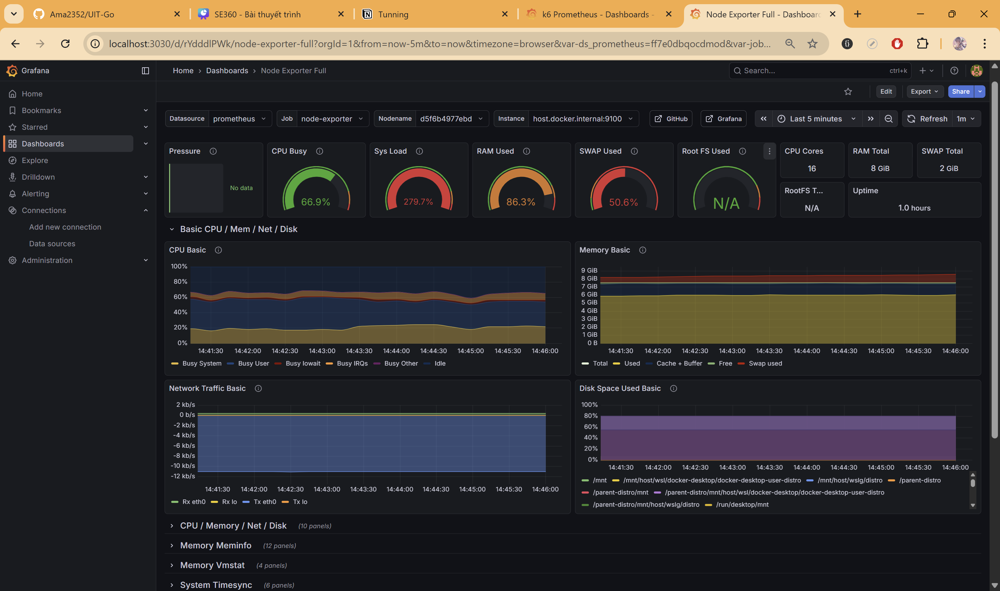

# Stress Test Analysis Report

## Summary

Verified high p95 latency sources using granular tracking. Confirmed `driver_accept` as the primary bottleneck.

## Metrics Overview

| Operation         | Avg Latency | p95 Latency | Status            |
| :---------------- | :---------- | :---------- | :---------------- |
| **Driver Accept** | ~1.59s      | **4.46s**   | 🔴 **Bottleneck** |
| Passenger Create  | ~0.82s      | 2.81s       | 🟡 High           |
| Driver Online     | ~0.67s      | 2.80s       | 🟡 High           |
| **Global HTTP**   | ~0.85s      | 3.43s       | -                 |

| Driver Online | ~0.67s | 2.80s | 🟡 High |
| **Global HTTP** | ~0.85s | 3.43s | - |

## CPU Metrics Analysis

- **CPU Busy**: 66.9% (High).
- **System Load**: **279.7%** (CRITICAL).
  - A load of 280% means there are nearly **3x more processes** trying to run than the CPU can handle at any given moment. This causes severe **Queuing**.

## Analysis

### 1. "p95 is high due to Driver_Online, Passenger_Create, or Driver_Accept?"

**Answer: Driver_Accept.**
All operations are slow, but `driver_accept` is significantly slower (approx 1.6s worse at p95 than the others).

- `driver_online` (Redis) and `passenger_create` (Postgres) both sit around 2.8s p95.
- `driver_accept` combines both (Read/Write Trip in DB + Redis Lock/Updates), roughly summing the latencies, which explains the ~4.5s result.

### 2. "Why Redis cause latency problem? Is it still a Redis problem?"

**It is NO LONGER considered just a Redis problem.**

- The **279% System Load** confirms that **CPU Starvation** is the root cause.
- Redis commands are simple and fast, but they are waiting in the OS CPU queue to be executed.
- `Passenger_Create` (Database Write) has the exact same p95 (~2.8s) as `Driver_Online` (Redis Write). This correlation proves they are both victims of the same resource shortage (Host CPU).

### 3. "Avg ~1s but p95 3.14s - Move to Read/Write Tuning?"

Yes, this confirms **Queuing**.

- Since the host is overloaded, we need to optimize **how we use the database**.
- **Read-Replica Tuning**: We can offload "Read" operations to the replicas (`trip-replica`). This might not reduce the _Host_ CPU load (since the replica is on the same machine), but it distributes the database lock contention and allows the Primary DB to focus on Writes.

## Next Steps

1.  **Check CPU Usage**: Look at the "Node Exporter" dashboard. If CPU is >90%, you just need more resources (or scale out replicas).
2.  **Check Connection Pools**: Monitor Postgres/Redis pool usage in the Go services. Are they hitting max limits?
3.  **Profile Redis**: Use `redis-cli --intrinsic-latency` or `slowlog` to see if specific commands are blocking.
